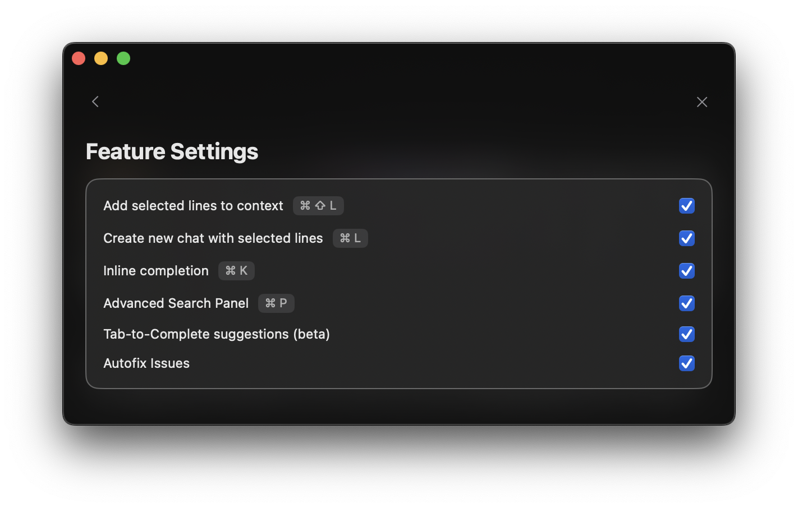

<Frame>
  
</Frame>

<Note>
  These shortcuts can be customized by clicking on any default shortcut in the Settings panel.
</Note>

## Code & Context
- **Command + L**: Start a new chat with your selected code
- **Command + Shift + L**: Add selected code to your current chat
- **Command + N**: Create a fresh chat (without code)
- **Command + Delete**: Stop the current generation

## Navigation & Search
- **Command + K**: Get inline completions
- **Command + P**: Open advanced search
- **Command + /**: Switch between AI models
- **Escape**: Close any open panel

<Note>
  Just getting started? Focus on:
  - **Command + L** to start AI chats about your code directly from Xcode
  - **Command + K** for quick inline completions
  - **Command + /** to switch between different AI models
</Note>

<Tip>
  Pro tip: The **Escape** key is your universal "close" button - it will close any
  open panel, whether it is a suggestion, search, or completion window.
</Tip>
