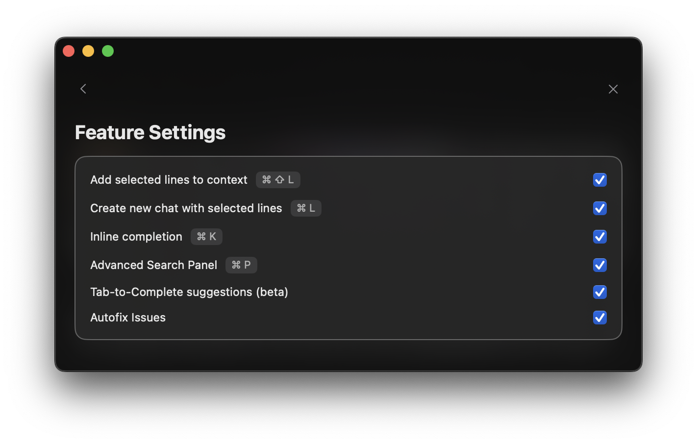

<Frame>
  
</Frame>

<Note>
  These shortcuts can be customized by clicking on any default shortcut in the Settings panel.
</Note>

- **Command + L**: Start a new chat with your selected code
- **Command + Shift + L**: Add selected code to your current chat
- **Command + N**: Create a fresh chat (without code)
- **Command + Delete**: Stop the current generation

<Note>
  Just getting started? The **Command + L** shortcut is essential for starting AI chats about your code directly from Xcode.
</Note> 